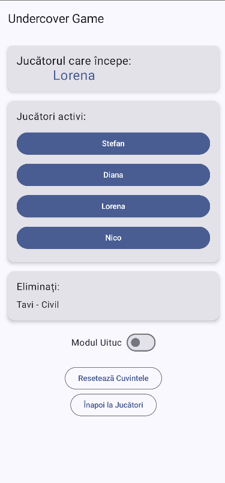

## Undercover - joc de societate pe Android

### Descrierea jocului
Aplicația Undercover este o adaptare digitală a jocului de societate cu același nume, unde jucatorii primesc roluri si cuvinte apropiate (castron vs farfurie) si scopul fiind acela de a identifica rolul oponenților fără a dezvălui identitatea proprie.


Jocul se desfășoară în runde, iar fiecare jucător primește un cuvânt secret. Jucătorii trebuie să comunice între ei folosind indicii subtile pentru a-și descoperi identitatea și a evita să fie descoperiți de ceilalți. La finalul fiecărei runde, jucătorii votează pentru a elimina un jucător suspectat de a fi undercover.

### Scenariu joc
1. Jucători undercover (au cuvantul "farfurie") : Stefan, Diana
2. Jucători civili (au cuvantul "castron") : Lorena, Tavi
3. Mr. White (nu are cuvant): Nicoleta



În prima rundă, Stefan zice "plat" iar Diana zice "supa". Nicoleta zice "perisoare. Ea este cea mai suspicioasă si jucatorii o elimină. 
Jocul continuă până când toți undercover sunt eliminați sau până când undercover reușește să elimine toți jucătorii normali.


### Despre aplicație - analiză State-of-the-Art
Am ales **Jetpack Compose** pentru a dezvolta aplicația, deoarece este un framework modern și declarativ pentru construirea interfețelor de utilizator pe Android. Acesta permite crearea de UI-uri reactive și ușor de întreținut, ceea ce este esențial pentru o aplicație de jocuri. De asemenea, Jetpack Compose oferă integrare ușoară cu alte biblioteci Android, cum ar fi ViewModel și LiveData, facilitând gestionarea stării aplicației.

Testarea se poate face folosind **Compose Test** sau **JUnit Test**, în funcție de nevoile specifice ale aplicației. Compose Test este ideal pentru **testarea interfeței** de utilizator, în timp ce JUnit Test este mai potrivit pentru testarea logicii aplicației și a funcționalităților **backend**. 
Ambele tipuri de teste sunt esențiale pentru asigurarea calității aplicației și pentru a ne asigura că aceasta funcționează corect pe diferite dispozitive și versiuni Android.

### Avantaje ale aplicației noastre
Față de [aplicația originală](https://apps.apple.com/bn/app/undercover-word-party-game/id946882449?uo=2), avem: 
- Generare de cuvinte din fișier CSV (ușor de extins) ❌ Generare folosind API ChatGPT ✅
- Opțiunea de a elimina/adăuga cuvinte marcate ca vulgare(18+)


### Resurse disponibile
- [Documentația oficială Jetpack Compose](https://developer.android.com/jetpack/compose/documentation)
- [Tutoriale Jetpack Compose](https://developer.android.com/jetpack/compose/tutorial)
- [Tutorial Compose Test](https://developer.android.com/jetpack/compose/testing)

## Scenarii de testare
### Testare UI - Compose Test Framework
- **WHEN** utilizatorul introduce jucătorii, **THEN** aplicația ar trebui să afișeze toți jucătorii în lista de jucători.
- **WHEN** râmân doi jucători, **THEN** aplicația ar trebui să afișeze mesajul "Jocul s-a terminat".

### Exemplu de test  - Compose Test Framework
```kotlin

class GameScreenTest {

    @get:Rule
    val composeTestRule = createComposeRule()

    @Test
    fun gameScreen_displaysCorrectInitialState() {
        val players = listOf(
            Player("Stefan", "Civil", "apple"),
            Player("Diana", "Civil", "apple"),
            Player("Tavi", "Undercover", "banana"),
            Player("Nicoleta", "Mr. White", ""),
            Player("Lorena", "Civil", "apple"),
        )

        composeTestRule.setContent {
            GameScreen(
                players = players,
                onGameEnd = {},
                onResetWords = {},
                onNavigateToPlayers = {}
            )
        }


        composeTestRule.onAllNodesWithText("Stefan").onFirst().assertIsDisplayed()
        composeTestRule.onAllNodesWithText("Diana").onFirst().assertIsDisplayed()
        composeTestRule.onAllNodesWithText("Tavi").onFirst().assertIsDisplayed()
        composeTestRule.onAllNodesWithText("Nicoleta").onFirst().assertIsDisplayed()
        composeTestRule.onAllNodesWithText("Lorena").onFirst().assertIsDisplayed()
    }

    @Test
    fun gameScreen_buttonStates_areCorrect() {
        val endGamePlayers = listOf(
            Player("Stefan", "Civil", "apple"),
            Player("Nicoleta", "Mr.White", "")
        )

        composeTestRule.setContent {
            GameScreen(
                players = endGamePlayers,
                onGameEnd = {},
                onResetWords = {},
                onNavigateToPlayers = {}
            )
        }

        composeTestRule.onNodeWithText("Jocul s-a terminat").assertIsDisplayed()
    }
}
```

### Setup-ul mediului de dezvoltare
- **Instalarea Android Studio**
- **Instalarea SDK-ului Android**
- **Instalarea Jetpack Compose**
- **Dependințe necesare**:
``` 
dependencies {
    implementation "androidx.compose.ui:ui:1.0.0" - # pentru UI
    implementation "androidx.compose.ui:ui-tooling-preview:1.0.0" - # pentru previzualizare
    implementation "androidx.activity:activity-compose:1.3.1" - # pentru activități
    testImplementation "junit:junit:4.13.2" - # pentru testare backend
    androidTestImplementation "androidx.compose.ui:ui-test-junit4:1.0.0" - # pentru testare UI
}

```
Structura proiectului:
```
Undercover_Android_Game/
├── ui/
│   ├── MainScreen.kt          # Configurare joc
│   ├── GameScreen.kt          # Logica eliminării jucătorilor
├── data/
│   ├── Player.kt              # Model de date pentru jucător
│   ├── WordGenerator.kt       # Generare cuvinte din CSV
├── navigation/
│   ├── NavGraph.kt            # Gestionarea rutelor
├── test/
│   ├── androidTest/
│   │   ├── ui/
│   │   │   ├── MainScreenTest.kt  # Teste UI pentru MainScreen
│   │   │   ├── GameScreenTest.kt  # Teste UI pentru GameScreen
│   ├── unitTest/
│   │   ├── data/
│   │   │   ├── PlayerTest.kt      # Teste unitare pentru Player
│   │   │   ├── WordGeneratorTest.kt # Teste unitare pentru WordGenerator
│   │   ├── navigation/
│   │   │   ├── NavGraphTest.kt     # Teste unitare pentru NavGraph
└── ...

```

### Decizii de design
- **Arhitectura aplicației**: Am ales să folosim arhitectura MVC (Model-View-Controller) pentru a separa business logic de interfața utilizatorului. Aceasta ne permite să gestionăm mai ușor starea aplicației și să facem modificări fără a afecta alte părți ale codului.
- **Adăugare de cuvinte în CSV**: Am implementat o funcționalitate care permite utilizatorilor să adauge cuvinte noi în fișierul CSV, astfel încât să putem extinde rapid lista de cuvinte disponibile pentru joc.

### Alte opțiuni de testare 
- **Mockito**: pentru simularea dependențelor și testare unitară
- **Firebase Test Lab**: pentru testarea aplicației pe diferite dispozitive și versiuni Android

### Tipuri de teste

---

- **Teste UI**

ex.: <i><b>GameScreenTest</b> testează afișarea corectă a stării inițiale a ecranului de joc.</i>

```
@Test
    fun gameScreen_displaysCorrectInitialState() {
        val players = listOf(
            Player("Stefan", "Civil", "apple"),
            Player("Diana", "Civil", "apple"),
            Player("Tavi", "Undercover", "banana"),
            Player("Nicoleta", "Mr. White", ""),
            Player("Lorena", "Civil", "apple"),
        )

        composeTestRule.setContent {
            GameScreen(
                players = players,
                onGameEnd = {},
                onResetWords = {},
                onNavigateToPlayers = {}
            )
        }


        composeTestRule.onAllNodesWithText("Stefan").onFirst().assertIsDisplayed()
        composeTestRule.onAllNodesWithText("Diana").onFirst().assertIsDisplayed()
        composeTestRule.onAllNodesWithText("Tavi").onFirst().assertIsDisplayed()
        composeTestRule.onAllNodesWithText("Nicoleta").onFirst().assertIsDisplayed()
        composeTestRule.onAllNodesWithText("Lorena").onFirst().assertIsDisplayed()
    }

```

---

- **Teste unitare**

ex.: <i>Clasa <b>WordGenerationTest </b> verifică funcționarea corectă a generatorului de cuvinte.</i>

```
@Test
    fun testWordGeneration() {
        val context = ApplicationProvider.getApplicationContext<Context>()
        val wordGenerator = WordGenerator(context)

        val generatedPairs = List(10) { wordGenerator.generateWords() }

        generatedPairs.forEach { (civilianWord, undercoverWord) ->
            assertNotNull(civilianWord)
            assertNotNull(undercoverWord)
            assertNotEquals(civilianWord, undercoverWord)
        }

        val uniquePairs = generatedPairs.toSet()
        assertTrue(uniquePairs.size > 1)
    }

```

---

- **Fuzzing tests**

Folosesc date de intrare generate aleatoriu pentru a verifica stabilitatea aplicației. Testele acoperă scenarii precum alegerea unui număr random de jucători în ecranul principal, completarea aleatorie a numelor jucătorilor, configurarea aleatorie a rolurilor Undercover și Mr. White și verifica valiarea atunci când sunt introduse date invalide sau incomplete. 

ex.: <i><b>ComposeFuzzingTests</b> include teste pentru diverse ecrane, cum ar fi distribuția rolurilor și validarea input-urilor.</i>
[Link catre clasa.](https://github.com/unibuc-cs/Undercover_Android_Game-TSS-2025/blob/develop/app/src/androidTest/java/com/example/undercover/ComposeFuzzingTests.kt)

---

- **Teste instrumentate (folosind androidx.compose.ui.test)**

ex.: <i>Clasa <b>PlayerSelectionScreenTest </b> verifică comportamentul și interacțiunea utilizatorului cu ecranul PlayerSelectionScreen, aplicația fiind Android scrisă în Kotlin.</i>

```
@Test
    fun startGameButton_enabledOnlyWhenAllNamesSet_andMinSize() {
        var lastList: List<Player> = emptyList()
        composeTestRule.setContent {
            PlayerSelectionScreen(initialPlayers) { lastList = it }
        }
        composeTestRule.onNodeWithText("Începe jocul")
            .assertIsNotEnabled()
        initialPlayers.indices.forEach { index ->
            composeTestRule.onNodeWithText("Jucător ${index + 1}")
                .performClick()
            composeTestRule.onNodeWithText("Introduceți numele")
                .performTextInput("P$index")
            composeTestRule.onNodeWithText("Confirmă")
                .performClick()
        }
        composeTestRule.onNodeWithText("Începe jocul")
            .assertIsEnabled()
        composeTestRule.onNodeWithText("Începe jocul")
            .performClick()
        assertEquals(3, lastList.size)
        lastList.forEachIndexed { i, p -> assertEquals("P$i", p.name) }
    }

```
---

### Framework-uri de testare

## Jetpack Compose Testing vs. Espresso

### Jetpack Compose Testing
 -> Utilizat pentru testarea aplicațiilor construite cu Jetpack Compose. Permite interacțiunea directă cu componentele Compose fără a necesita un dispozitiv sau emulator, rulând rapid pe JVM. 

<b>Avantaje:</b> 
- **integrare nativa cu Compose**
- **teste declarative si intuitive**

<b>Dezavantaje:</b> 
- **limitat exclusiv la aplicatii ce folosesc Compose**
- **nu poate fi aplicat pe interfete clasice XML**

---

### Espresso
 -> Utilizat pentru testarea aplicațiilor Android clasice sau hibride, indiferent dacă UI-ul este construit în XML sau Compose. Permite testarea interacțiunilor reale ale utilizatorului cu interfața aplicației și necesită rulare pe un dispozitiv sau emulator.

<b>Avantaje:</b> 
- **flexibilitatea și suportul pentru interacțiuni complexe (ex. gesturi sau navigare între ecrane)**

<b>Dezavantaje:</b> 
- **configurarea mai complexă**
- **rularea mai lentă**
- **necesita un emulator pentru executie!!**

### Diferente de cod

- **Crearea layout-ului xml similar cu cel creat deja folosind Compose**

```
<?xml version="1.0" encoding="utf-8"?>
<LinearLayout
   xmlns:android="http://schemas.android.com/apk/res/android"
   android:orientation="vertical"
   android:layout_width="match_parent"
   android:layout_height="match_parent"
   android:padding="16dp">


   <EditText
       android:id="@+id/playerCountEditText"
       android:layout_width="match_parent"
       android:layout_height="wrap_content"
       android:hint="Număr de jucători" />


   <Button
       android:id="@+id/startGameButton"
       android:layout_width="match_parent"
       android:layout_height="wrap_content"
       android:text="Începe Jocul" />


   <TextView
       android:id="@+id/errorMessageTextView"
       android:layout_width="wrap_content"
       android:layout_height="wrap_content"
       android:text="Introdu un număr între 3 și 20!"
       android:visibility="gone" />
</LinearLayout>
```

- **Testarea UI ului creat**
```
package com.example.undercover.ui
 
 import android.os.Bundle
 import android.widget.Button
 import android.widget.EditText
 import android.widget.TextView
 import androidx.appcompat.app.AppCompatActivity
 import com.example.undercover.R
 
 class TestXmlActivity : AppCompatActivity() {
     override fun onCreate(savedInstanceState: Bundle?) {
         setTheme(androidx.appcompat.R.style.Theme_AppCompat_Light_NoActionBar)
         super.onCreate(savedInstanceState)
         setContentView(R.layout.activity_test)
 
         val playerCountEditText = findViewById<EditText>(R.id.playerCountEditText)
         val startGameButton = findViewById<Button>(R.id.startGameButton)
         val errorMessageTextView = findViewById<TextView>(R.id.errorMessageTextView)
 
         startGameButton.setOnClickListener {
             val playerCountText = playerCountEditText.text.toString()
             val playerCount = playerCountText.toIntOrNull()
 
             if (playerCount == null || playerCount < 3 || playerCount > 20) {
                 errorMessageTextView.visibility = TextView.VISIBLE
             } else {
                 errorMessageTextView.visibility = TextView.GONE
             }
         }
     }
 }
```

- **Testul propriu-zis**
```
package com.example.undercover.ui


import androidx.test.ext.junit.rules.ActivityScenarioRule
import androidx.test.ext.junit.runners.AndroidJUnit4
import androidx.test.espresso.Espresso.onView
import androidx.test.espresso.action.ViewActions.*
import androidx.test.espresso.assertion.ViewAssertions.matches
import androidx.test.espresso.matcher.ViewMatchers.*
import org.junit.Rule
import org.junit.Test
import org.junit.runner.RunWith


@RunWith(AndroidJUnit4::class)
class TestXmlActivityEspressoTest {


   @get:Rule
   val activityRule = ActivityScenarioRule(TestXmlActivity::class.java)


   @Test
   fun testTypeAndClick() {
       onView(withHint("Număr de jucători"))
           .perform(typeText("2"), closeSoftKeyboard())


       onView(withText("Începe Jocul"))
           .perform(click())


       onView(withText("Introdu un număr între 3 și 20!"))
           .check(matches(isDisplayed()))
   }
}

```

| Componentă                  | Rol                                                                 |
|------------------------------|---------------------------------------------------------------------|
| `activity_test.xml`          | UI-ul clasic cu EditText + Button + TextView                      |
| `TestXmlActivity.kt`         | Activitatea Android care încarcă acel XML și pune logica (click pe buton = verificare număr) |
| `TestXmlActivityEspressoTest.kt` | Testul automatizat Espresso care simulează ce face utilizatorul pe acel XML |

- **toate cele de mai sus, in timp ce folosind Jetpack Compose, scriem totul direct in Kotlin**
- **in Jetpack Compose, scrie UI-ul ca functii Kotlin (se numesc @Composable functions)**
- **totul e mai dinamic, mai modular si mai rapid (UI-ul se actualizeaza automat cand datele se schimba)**
- **Exemplu:**
```
class PlayerSelectionScreenTest {

    @get:Rule
    val composeTestRule = createComposeRule()

    private val initialPlayers = listOf(
        Player("", "", ""),
        Player("", "", ""),
        Player("", "", "")
    )

    @Test
    fun addPlayer_increasesListSize() {
        var lastList: List<Player> = emptyList()
        composeTestRule.setContent {
            PlayerSelectionScreen(initialPlayers) { lastList = it }
        }
        composeTestRule.onNodeWithContentDescription("Add")
            .performClick()
        composeTestRule.onNodeWithText("Adaugă jucător")
            .assertIsEnabled()
        composeTestRule.onNodeWithText("Începe jocul")
            .assertIsNotEnabled()
    }
...
}

```
| Avantaje                   | Compose                                  | XML clasic                                      |
|-----------------------------|------------------------------------------|-------------------------------------------------|
| Viteză și flexibilitate UI  | UI mai rapid și mai flexibil             | UI greu de modificat                           |
| Claritate cod               | Cod mai puțin și mai clar                | Cod mult, separare rigidă XML/Kotlin            |
| Testare                     | Ușor de testat cu Compose Testing       | Testare mai complicată (Espresso)               |
| Performanță                 | Performanță mai bună                    | Poate deveni lent cu multe layouturi            |


## Mutation Testing - Generator de Mutanți în proiectul Undercover (Android + Jetpack Compose)
 Descriere generală
Mutation Testing este o metodă de testare software care implică generarea de versiuni ușor modificate („mutanți”) ale codului sursă. Scopul este de a verifica dacă testele unitare pot detecta aceste modificări. Dacă un test nu pică în fața unui mutant, este considerat slab.

Scopul principal: evaluarea robusteții testelor automate.

Exemplu simplu de mutație:
``` 
// Cod original
if (a > b) { ... }

// Mutant generat automat
if (a >= b) { ... }
```
Dacă testele nu detectează această modificare, înseamnă că ele nu validează corect comportamentul așteptat.

Framework folosit – PIT (Pitest)
Pentru limbajele Kotlin/Java care rulează pe JVM, framework-ul standard pentru mutation testing este:

🔗 PIT – https://pitest.org/ – un instrument robust folosit în mod frecvent pe proiecte Java/Kotlin backend.

Configurare PIT în proiect Gradle (JVM):
1. În build.gradle (root):
```
buildscript {
    dependencies {
        classpath 'info.solidsoft.gradle.pitest:gradle-pitest-plugin:1.7.4'
    }
}
```
2. În app/build.gradle:
```
apply plugin: 'info.solidsoft.pitest'

pitest {
    targetClasses = ['com.example.undercover.data.*']
    targetTests = ['com.example.undercover.*']
    mutators = ['STRONGER']
    outputFormats = ['HTML']
    timestampedReports = false
}
```
3. Comanda pentru rulare:
```
./gradlew pitest
```
🗂️ Raportul HTML se generează în:
```
app/build/reports/pitest/index.html
```
## De ce NU funcționează mutation testing pe aplicația noastră Jetpack Compose ##

| ❌ Problema                          | ✅ Explicație                                                                  |
| ----------------------------------- | ----------------------------------------------------------------------------- |
| Nu rulează pe teste instrumentate   | PIT funcționează doar pe JVM pur, nu pe teste Android cu context real         |
| Cod Compose nu e logică executabilă | `@Composable` este declarativ, nu poate fi „mutat” logic                      |
| Context Android blochează testarea  | Orice clasă care folosește `Context`, `Assets`, `Activity` devine netestabilă |
| UI-ul nu poate fi „mutat” logic     | Codul Compose descrie UI, nu oferă logică testabilă                           |

## Exemple de cod compatibil / incompatibil ##

❌ Cod incompatibil:
```
@Composable
fun MainScreen() {
    // UI declarativ
}
```
✅ Cod compatibil (doar dacă e scos din context Android):
```
fun areWordsSimilar(a: String, b: String): Boolean {
    val distance = levenshteinDistance(a, b)
    return distance < 2
}
```
| ✅ Soluție                   | 💬 Descriere                                                             |
| --------------------------- | ------------------------------------------------------------------------ |
| Extrage logică pură         | Creează un modul `:core` fără `android.*` și `@Composable`               |
| Rulează PIT doar pe `:core` | Aplică mutation testing pe module standalone, scrise doar în Kotlin JVM  |
| Pentru UI folosește Compose | Jetpack Compose Testing este dedicat pentru testarea logicii declarative |
| Documentează limitarea      | Specifică în README că mutation testing nu funcționează pe UI Android    |


## Concluzie

În proiectul nostru am ales să folosim **Jetpack Compose Testing** în locul framework-ului clasic **Espresso** deoarece:

- Aplicația noastră este dezvoltată integral folosind **Jetpack Compose**, ceea ce face ca testarea nativă în Compose să fie mai naturală și mai eficientă.
- **Compose Testing** oferă o integrare directă cu componentele UI moderne, permițând scrierea de teste declarative, concise și mai ușor de întreținut.
- Testele Compose rulează mai rapid pe JVM, fără a necesita emulator sau dispozitiv fizic, accelerând semnificativ ciclul de dezvoltare și feedback.
- Codul de testare în Compose este mai clar și mai expresiv comparativ cu Espresso, care presupune o configurare mai complexă și o rulare mai lentă.

Deși **Espresso** rămâne un framework puternic pentru aplicațiile Android bazate pe XML sau hibride, în cazul nostru, datorită utilizării exclusive a **Jetpack Compose**, alegerea **Compose Testing** a fost soluția optimă pentru a beneficia de toate avantajele moderne ale platformei Android.
