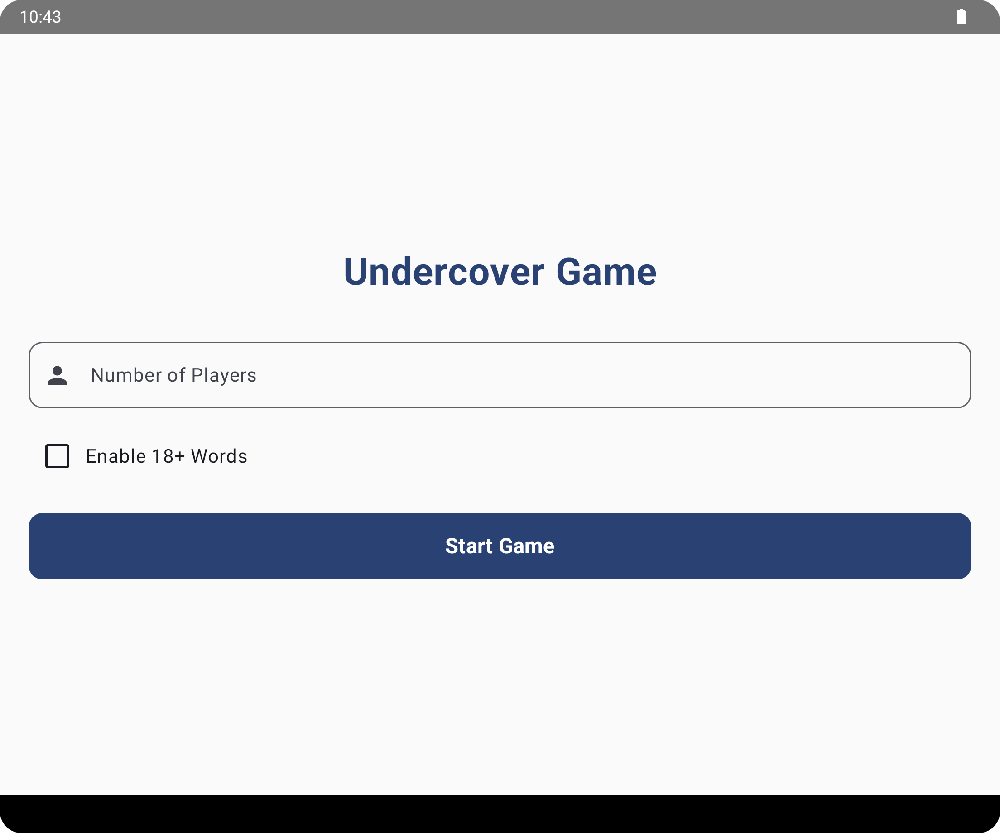
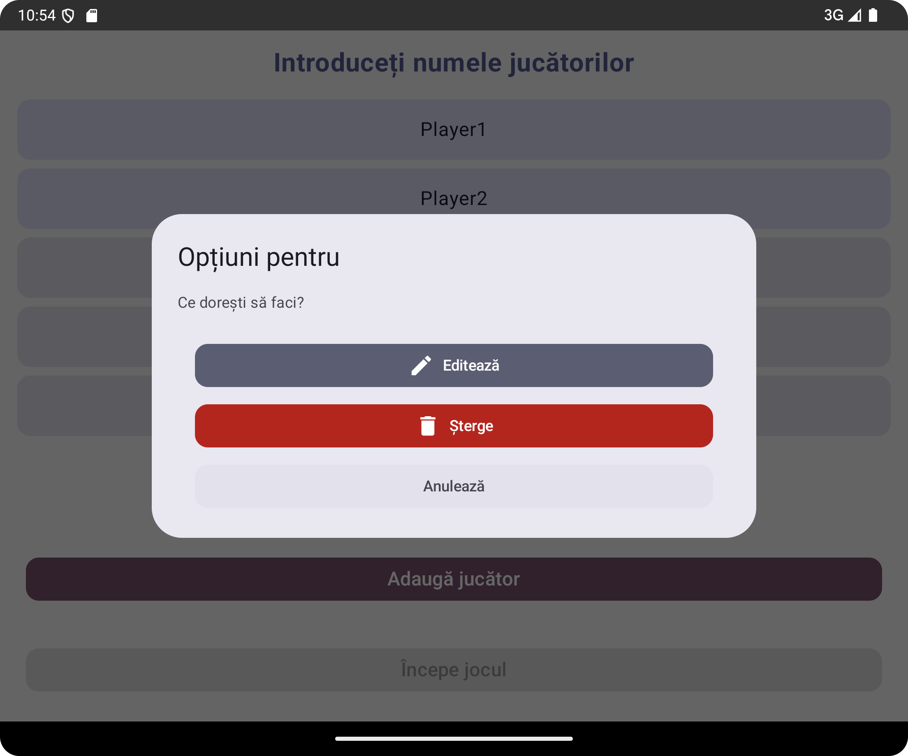
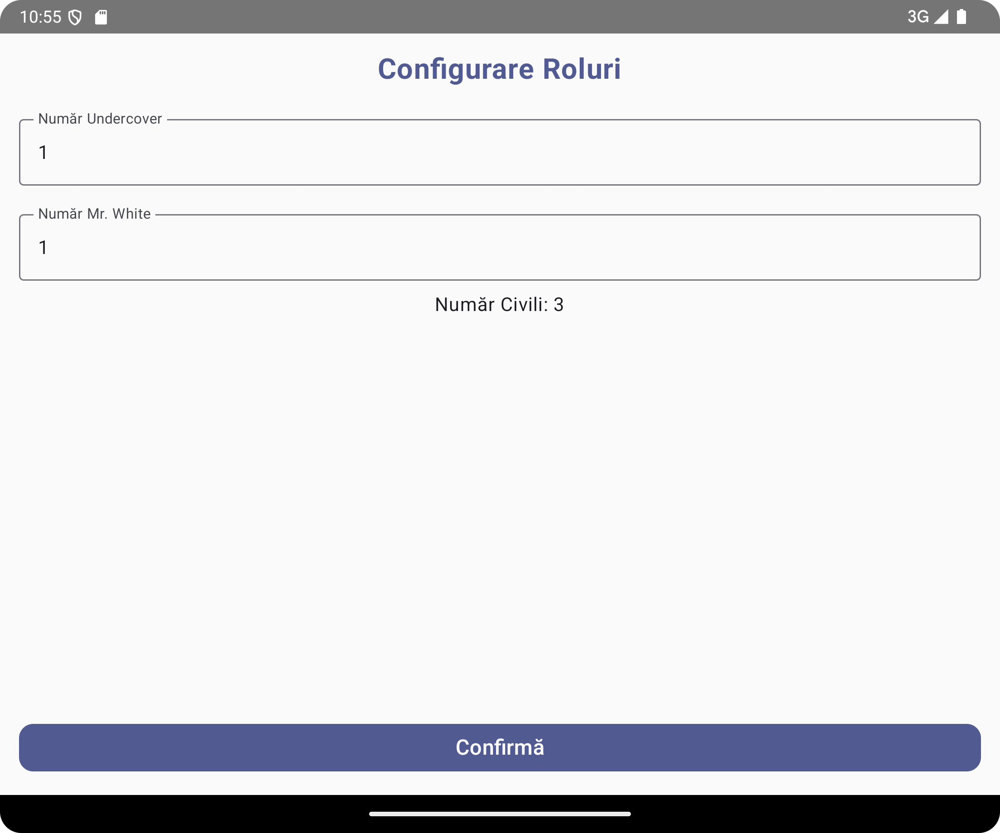
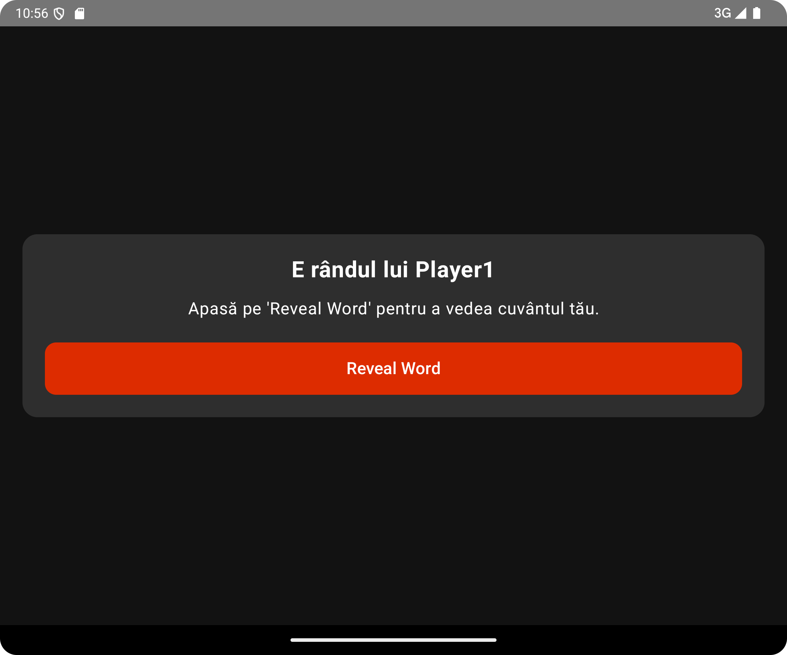
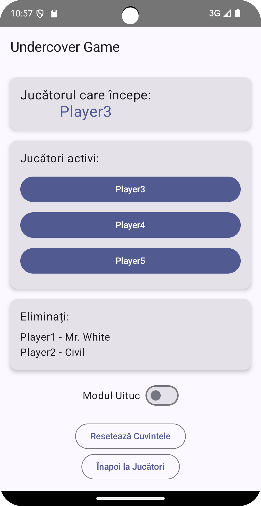

# Undercover Game - Android App

Undercover Game is a mobile application developed in **Android Studio** using **Jetpack Compose**.
This is a digital adaptation of the Undercover board game, where players receive roles and similar
words, and their goal is to identify opponents without exposing their own identity.

---

## 📸 Screenshots

### 1️⃣ Main Screen

*Description: Allows the user to choose the number of players and whether they want to include 18+
words (not yet implemented).*



### 2️⃣ Player Selection

*Description: Each player can enter their name, and users can add or remove players.*



### 3️⃣ Role Configuration

*Description: Sets the number of **Undercover** and **Mr. White**, while the rest will be
Civilians.*



### 4️⃣ Role Assignment

*Description: Each player sees a pop-up with their name and has the option to press "Reveal Word" to
see their assigned word.*



### 5️⃣ Game Screen

*Description: Players eliminate others in turns, and if Mr. White is eliminated, they must guess the
civilians' word.*



---

## 🔧 Implemented Features

✅ Modern interface using **Jetpack Compose**
✅ Navigation between screens with **Jetpack Navigation**
✅ Predefined **word set** based on a CSV file
✅ Automatic role distribution based on the number of players
✅ Ability to eliminate players and display their roles after elimination
✅ Mechanism for **Mr. White** to guess the word
✅ The 18+ word option is **not yet implemented**

---

## 📂 Project Architecture

- `MainScreen.kt` - Main screen for game setup
- `PlayerSelectionScreen.kt` - Player selection and name input
- `RoleConfigurationScreen.kt` - Configuration of **Undercover** and **Mr. White** count
- `RoleAssignmentScreen.kt` - Role assignment and word display
- `GameScreen.kt` - Game management and player elimination
- `WordGenerator.kt` - Class responsible for generating word pairs
- `Player.kt` - Data model for a player
- `NavGraph.kt` - Navigation configuration between screens

---

## 🚀 How to Run the Application

1. Clone this repository:

```sh
   git clone https://github.com/omacelaru/Undercover_Android_Game
```

2. Open the project in **Android Studio**
3. Run the app on an emulator or a real device

---

## 🛠️ Planned Improvements

🔹 Adding more word sets for variety
🔹 Optimizing the interface for a smoother experience

---

## 📬 Contact

If you have suggestions or questions, feel free to open an issue on GitHub.

**🎮 Have fun playing Undercover!**

